# ANSIBLE DYNAMIC ASSIGNMENTS (INCLUDE) AND COMMUNITY ROLES

## Introducing Dynamic Assignment Into Our structure
In your https://github.com/<your-name>/ansible-config-mgt GitHub repository start a new branch and call it dynamic-assignments

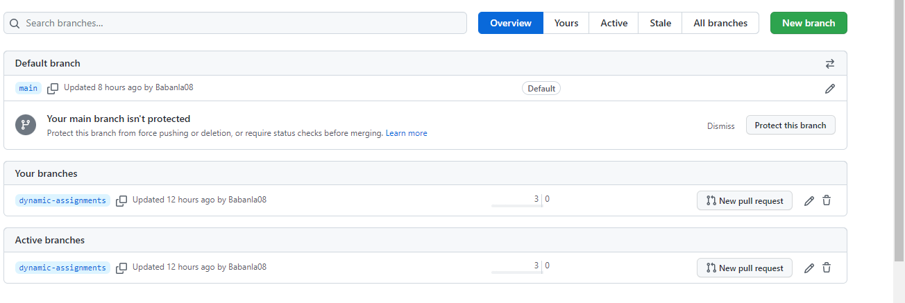

## Create a new folder, name it dynamic-assignments. Then inside this folder, create a new file and name it env-vars.yml. We will instruct site.yml to include this playbook later

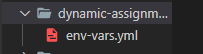

## create a folder to keep each environment’s variables file. Therefore, create a new folder env-vars, then for each environment.

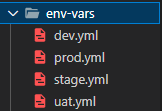

## Now paste the instruction below into the env-vars.yml file

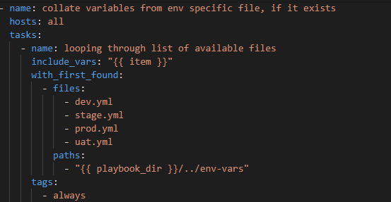

## Update site.yml file to make use of the dynamic assignment

## Download Mysql Ansible Role, Apache and Nginx by Geerlingguy In roles directory

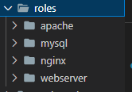

## Configure the Apache and Nginx roles to suit our usage

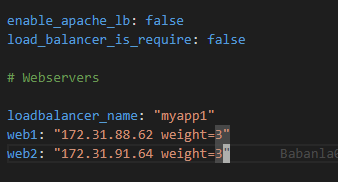

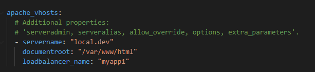

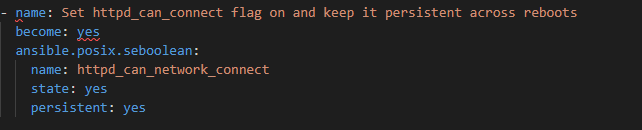

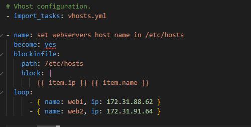

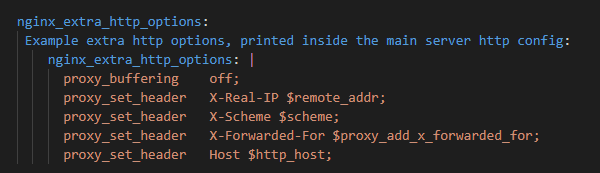

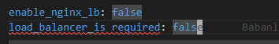

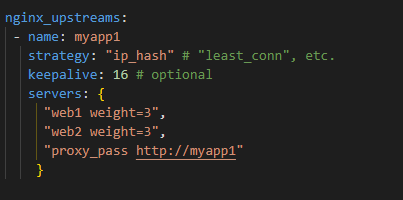

## Since you cannot use both Nginx and Apache load balancer, you need to add a condition to enable either one

## Create loadbalancers yml file, db yml file and update site yml file in playbook

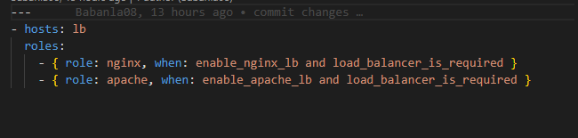

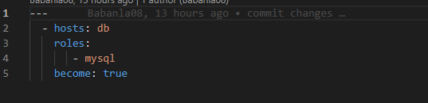

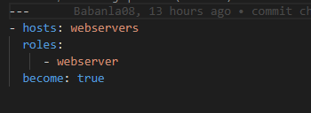

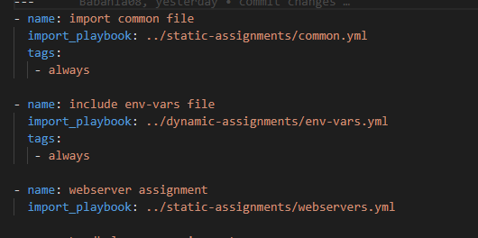

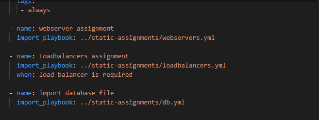

## Now you can make use of env-vars\uat.yml file to define which loadbalancer to use in UAT environment by setting respective environmental variable to true

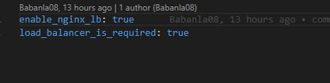

# Run ansible playbook

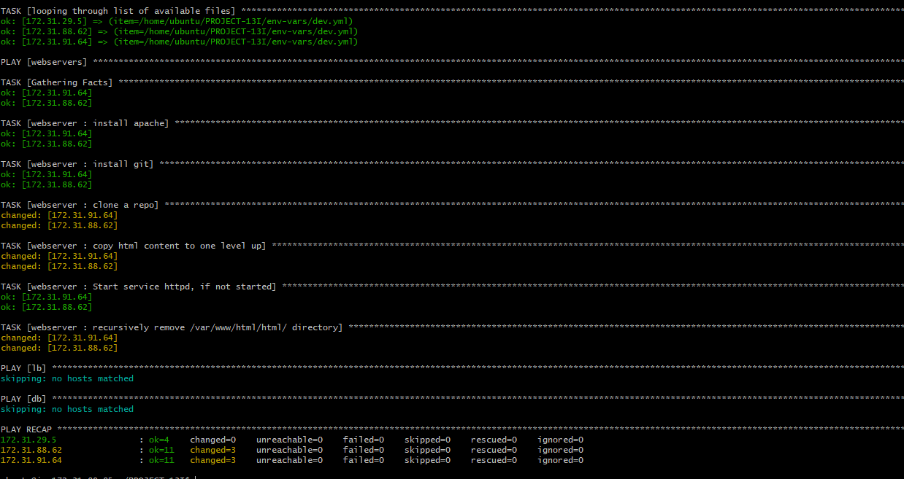
